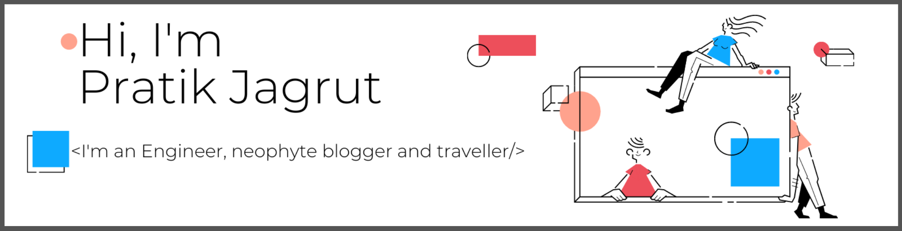

---
<!-- ### Hi there 👋 -->
<!-- ### I'm Pratik, I'm an Engineer, neophyte blogger and traveler -->

- 💻🚀 Community-Driven Software Engineer

- 🌍 Enthusiast of cloud-native development and open-source technologies, diving into the world of 💻

- 🚀 Proficient in Kubernetes, GoLang, Python, Docker, and more fascinating container technologies 🐳

- 🎓 CKA certified! 🎓📜

- 🎤 Passionate about technical evangelism, sharing knowledge and insights at prestigious events worldwide 🌍 Exhilarated by the stage! 🎙️

- 📝 Pouring thoughts into engaging technical blogs 📝

- ✈️ Enjoys traveling and seeking thrilling adventures 🗺️🌄

- 🤝 Let's connect and explore exciting opportunities together! 🔍😊

- 📫 *Look me up @*
    
    [][twitter]
    [][linkedin]
    [][website]
    [][mailto]
     

    
<!-- - 😄 Pronouns: ... -->

<!-- - 🥅 My 2020 goal is to at least publish 50 blogs visit my blog at [pratikjagrut.dev]() -->

<!-- - 👯 I’m looking to collaborate on ... -->

<!-- - 🤔 I’m looking for help with ... -->

### Languages and Tools in my Arsenal:

[][Golang]&ensp;
[][Python]&ensp;
[][Bash]&ensp;
[][Kubernetes]&ensp;
[][Openshift]&ensp;
[][Git]&ensp;
[][Jenkins]&ensp;
[][Fedora]&ensp;
[][Hugo]&ensp;
[][VScode]&ensp;
<!--  &ensp; -->

# My Latest Blog Posts
<!-- BLOG-POST-LIST:START -->
- [Concurrency in Go &lpar;Part-3&rpar;: sync package primitives](https://psj.codes/concurrency-in-go-part-3-sync-package-primitives)
- [Concurrency in Go &lpar;Part-2&rpar;: sync package primitives](https://psj.codes/concurrency-in-go-part-2-sync-package-primitives)
- [Concurrency in Go &lpar;Part-1&rpar;: Goroutines, Channels and Select](https://psj.codes/concurrency-in-go-part-1-goroutines-channels-and-select)
- [Git Aliases](https://psj.codes/git-aliases)
- [Error Handling in Go &lpar;Part-2&rpar;](https://psj.codes/error-handling-in-go-part-2)
<!-- BLOG-POST-LIST:END -->

<!-- Github stats -->
<!-- 

 -->

[website]: https://psj.codes/
[twitter]: https://twitter.com/pratikjagrut
[linkedin]: https://www.linkedin.com/in/pratikjagrut
[Golang]: https://go.dev 
[Python]: https://www.python.org/
[Bash]: https://www.gnu.org/software/bash/
[Git]: https://git-scm.com/
[Fedora]: https://fedoraproject.org/wiki/Fedora_Project_Wiki
[Hugo]: https://gohugo.io/
[Kubernetes]: https://kubernetes.io/
[Openshift]: https://www.openshift.com/
[VScode]: https://code.visualstudio.com/
[Jenkins]: https://www.jenkins.io/
[mailto]: mailto:jagrut.pratik@gmail.com
